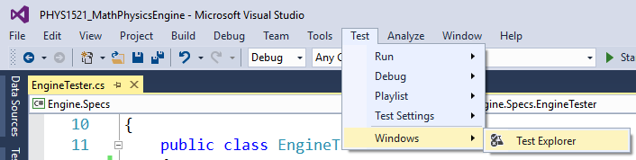
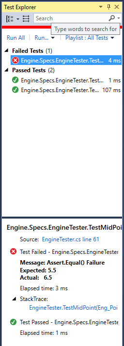
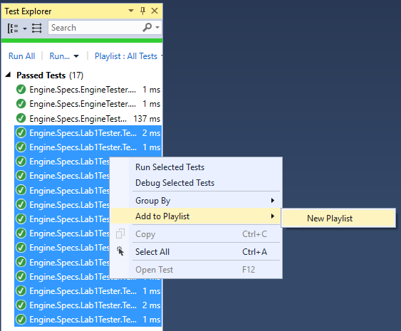
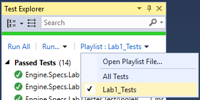

# Math/Physics Engine

## Introduction
This project does not create a fully functional Math/Physics engine for game programming. This project is a teaching tool for students enrolled in PHYS1521, in the DMIT program, at NAIT. Students enrolled in PHYS1521 will make changes and modifications to this engine as part of their course lab work.

## How to use?
Simply download (ZIP) this project to your computer (cloning is not required no recommended). Students will need to sign up and create their own GitHub account then upload their working copy to a repository named **PHYS1521**. Once all files are uploaded to the repository create a branch called **in-class** for any in-class work/notes, and a branch called **Lab1** in order to set up for the first lab.

## Sample Code
Some sample code is provided in the initial project solution. The `Eng_Point2D` class is defined as:

```csharp
namespace Engine.Classes
{
    public class Eng_Point2D
    {
        public double x { get; set; }
        public double y { get; set; }

        public Eng_Point2D() { }
        public Eng_Point2D(double x, double y)
        {
            this.x = x;
            this.y = y;
        }
    }
}
```

In the `Calculator.cs` class file there is some sample methods:
```csharp
namespace Engine
{
    public class Calculator
    {
        public static double SegmentLength(Eng_Point2D a, Eng_Point2D b)
        {
            return Math.Sqrt(Math.Pow(b.x - a.x, 2) + Math.Pow(b.y - a.y, 2));
        }

        public static Eng_Point2D MidPoint(Eng_Point2D a, Eng_Point2D b)
        {
            return new Eng_Point2D(0.5 * (a.x + b.x), 0.5 * (a.y + b.y));
        }
    }
}
```

To test the sample methods there is a test project, `Engine.Specs`, that is set up to have your code automatically tested. The test class, called **EngineTester.cs** has the following code:

```csharp
using System;
using System.Collections.Generic;
using System.Linq;
using System.Text;
using System.Threading.Tasks;
using Engine.Classes;
using Xunit;

namespace Engine.Specs
{
    public class EngineTester
    {
        #region Test Segment Length
        [Theory]
        // Instructor Data
        [InlineData(0, 0, 3, 4, 5)]
        // Student Data
        [InlineData(-1, -1, 2, 3, 5)]
        public void TestSegmentLength(double aX, double aY, double bX, double bY, double expected)
        {
            // Arrange - get data to do the test
            Eng_Point2D givenA = new Eng_Point2D(aX, aY);
            Eng_Point2D givenB = new Eng_Point2D(bX, bY);
            // Act - performing the action
            var actual = Calculator.SegmentLength(givenA, givenB);
            // Assert - did we get back the correct answer
            Assert.Equal(expected, actual);
        }
        #endregion

        #region Test MidPoint
        // Static method to set up Object-based test data
        public static IEnumerable<Object[]> MidPointData()
        {
            // Instructor Data
            // 1st new Eng_Point2D is the point A
            // 2nd new Eng_Point2D is the point B
            // 3rd new Eng_Point2D is the expected outcome
            yield return new Object[]
            {
                new Eng_Point2D(3, 4),
                new Eng_Point2D(6, 9),
                new Eng_Point2D(4.5, 6.5)
            };

            // Student Data
            // 1st new Eng_Point2D is the point A
            // 2nd new Eng_Point2D is the point B
            // 3rd new Eng_Point2D is student expected outcome
            yield return new Object[]
            {
                new Eng_Point2D(3, 4),
                new Eng_Point2D(6, 9),
                new Eng_Point2D(4.5, 5.5)
            };
        }

        [Theory]
        [MemberData("MidPointData")]
        public void TestMidPoint(Eng_Point2D givenA, Eng_Point2D givenB, Eng_Point2D expected)
        {
            // Arrange - get data to do the test
            // This test uses [MemberData]
            // Act - performing the action
            Eng_Point2D actual = Calculator.MidPoint(givenA, givenB);
            // Assert - did we get back the correct answer
            Assert.Equal(expected.x, actual.x);
            Assert.Equal(expected.y, actual.y);
        }
        #endregion
    }
}
```

To run a test first stat the Test Explorer (this will cause your solution to do a Build):



In the initial code selecting **Run All** yeields the following result:



The failed test was selected to show what was expected and what was returned by the method. This should aid you in debugging your methods.

**NOTE**:
There are areas setup as Instuctor Data. DO NOT change this data, only add your Student Data to the appropriate areas of the code.

## Testing Hints
### Tuple's
Some of the labs require you to create and return a `Tuple<double, double>`. To test the return of a Tuple:

```csharp
Tuple<double, double> actual = Calculator.SomeMethodName(param1, param2);
// Assert - did we get back the correct answer rounded to 4 decimal places
Assert.Equal(tupleValue1, Math.Round(actual.Item1, 4));
Assert.Equal(tupleValue2, Math.Round(actual.Item2, 4));
```

### Playlists
Once you create all the xunit tests for a lab you can create a playlist. To do this simply select all the tests in the Test Explorer you want to add to your playlist.



You will then be prompted to name and save your playlist. It is recommended that you save your playlist at the root of your repository for ease of locating and for backup purposes. Once your playlist has been created you can select your playlist and run just those tests.



## Student's Responsibilities!
It is each student's responsibility to maintain the code integrity of their individual work. To do this each student's repository on GitHub will be in a private repository. Students **must** add their instructor as a [collaborator](https://help.github.com/articles/inviting-collaborators-to-a-personal-repository/) to thier repository for grading purposes.

## Backups
There is no need to _backup_ your code to a USB device, as GitHub  will be your backup; you can either:

* access your files via [GitHub](http://github.com) or
* install [GitHub Desktop](https://desktop.github.com) to access your repository

## Author
Name: Allan Anderson  
Phone: 780.378.5275  
Email: aanderson@nait.ca
